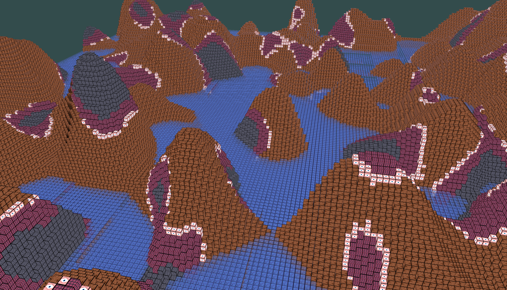

# OpenGLVoxelEngine
A voxel engine written in c++ and OpenGL with GLFW and GLAD. 




# Build - VSCode (Windows)

Run the following script:
```cmd
.\Project_Setup.bat
```

Once all of the dependencies have been installed, use the cmake tools extension to build the project

## CMake Tools
## Select a kit:
This project is compiled with the Visual Studio Community 2022 Release - amd64 kit. To select a kit (or a similar one) enter the command "CMake: Select a Kit".

Then run "CMake: Build" and finally "CMake: Debug";


# Developer Notes:

## TODO:
* ### Optimize chunk mesh
    - Only render the top faces exposed to air $\checkmark$
    - Have chunks talk to neighbors so touching voxels dont render inside faces